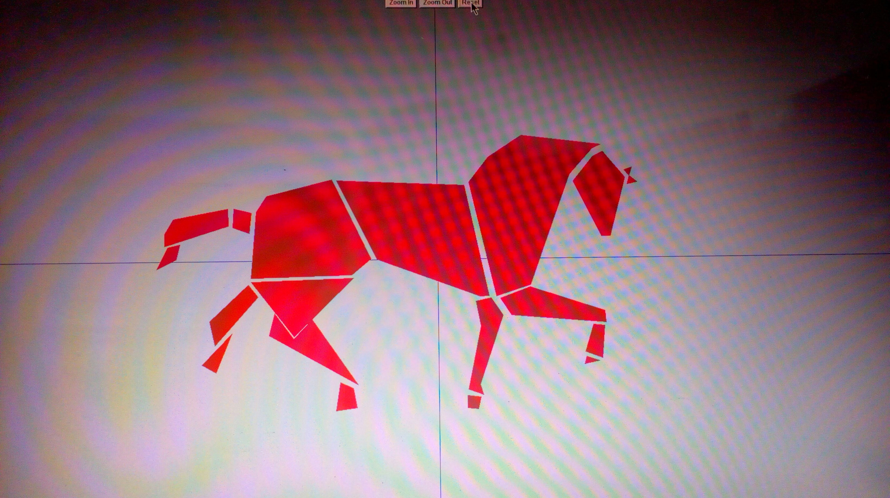
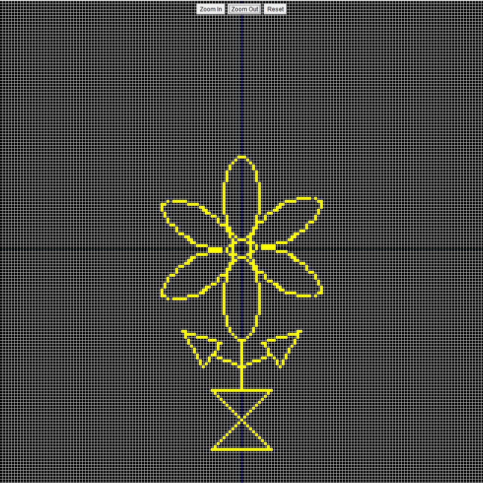
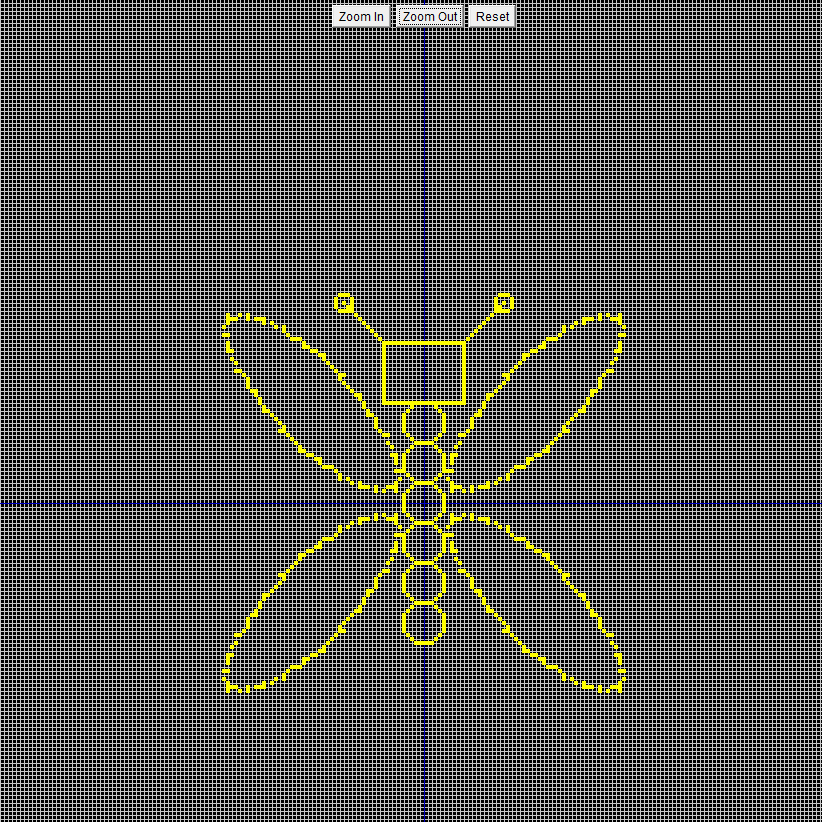
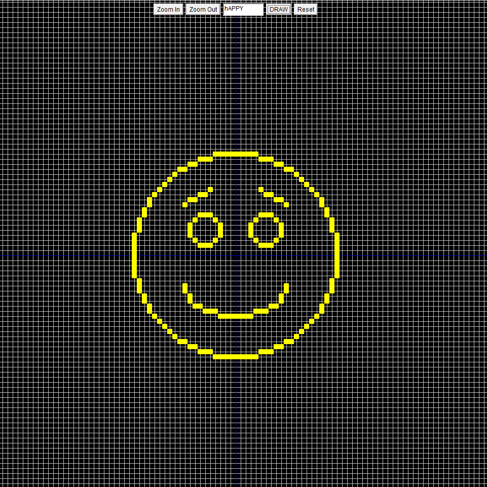
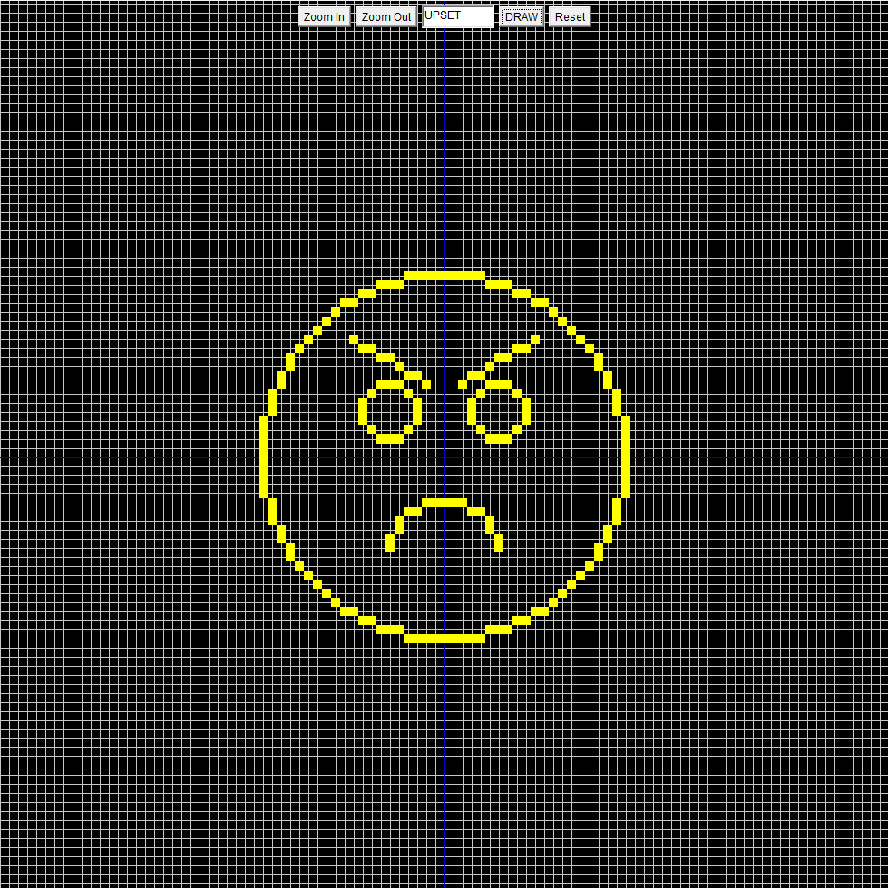
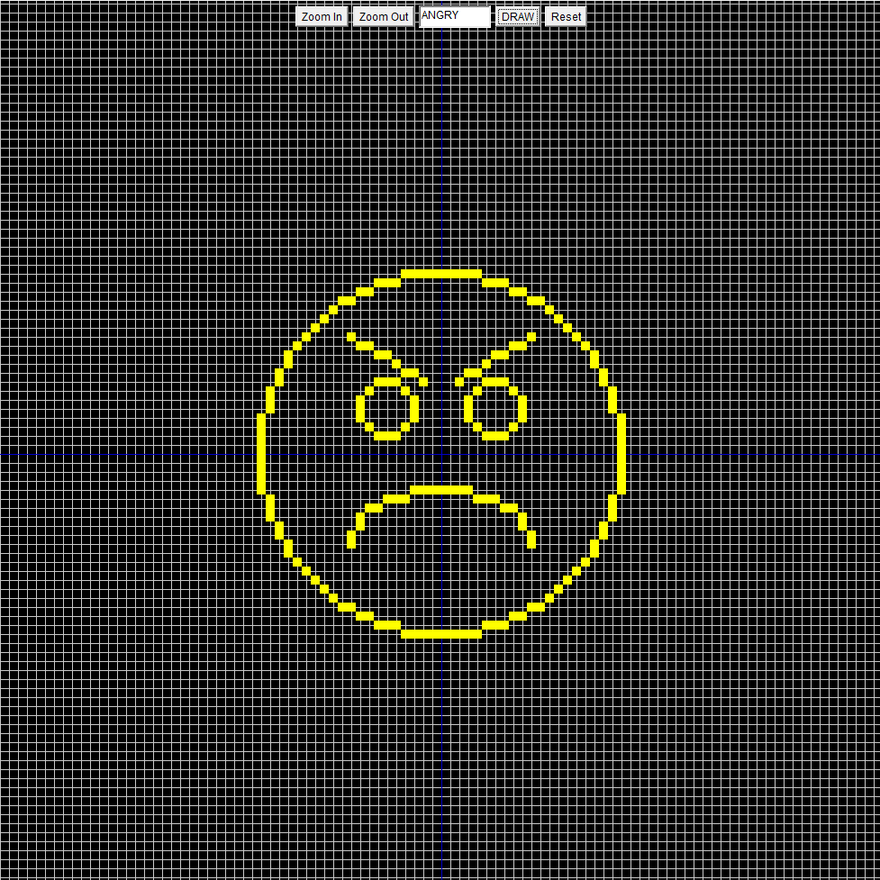
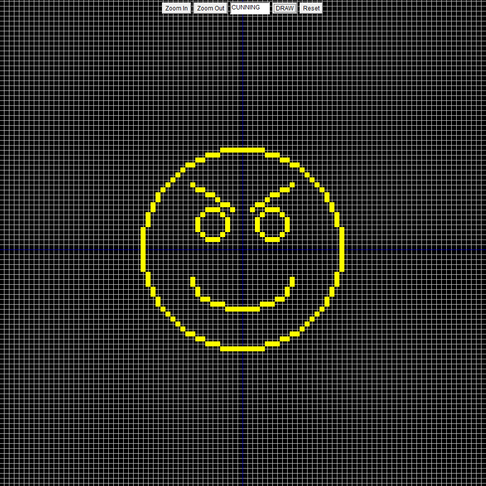
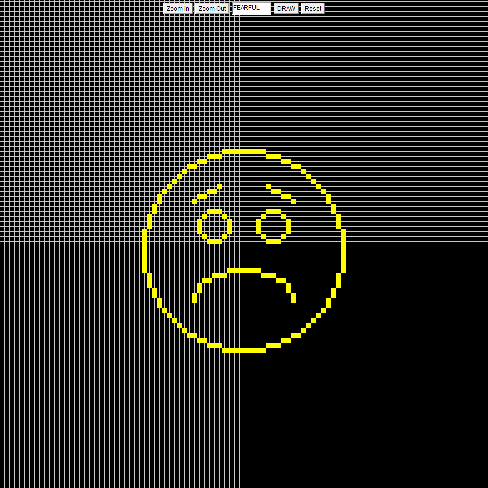
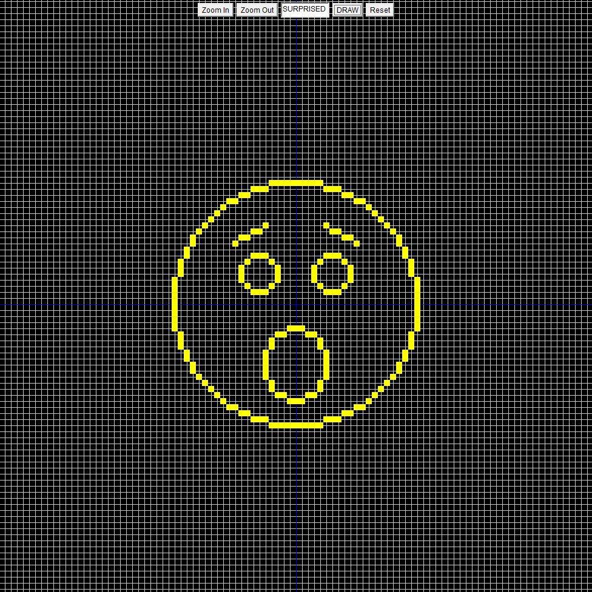
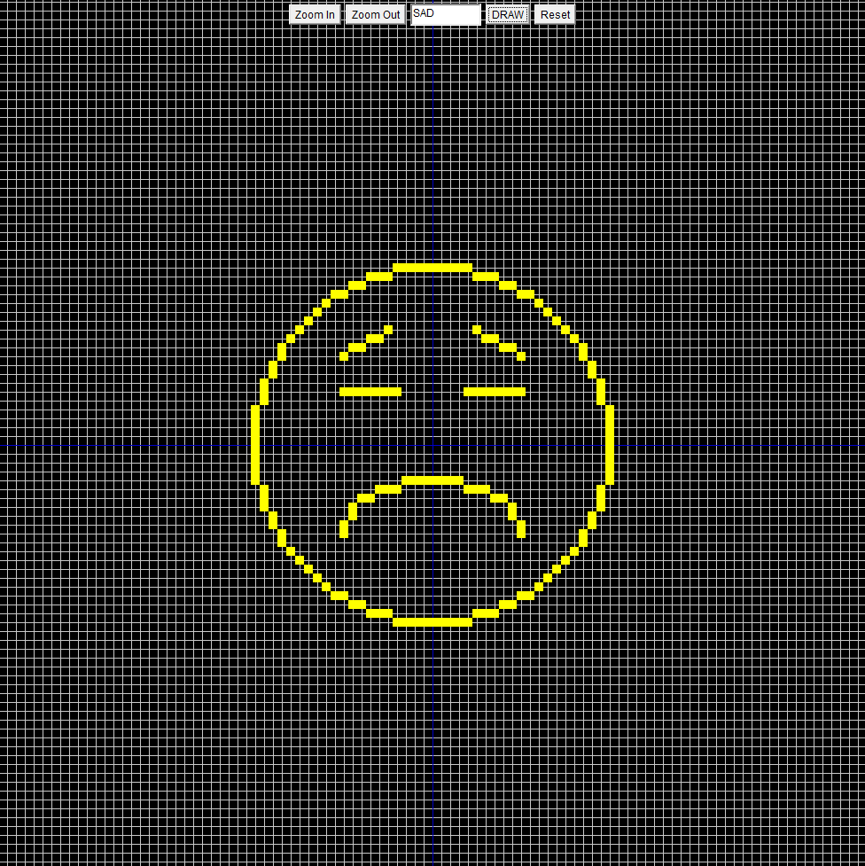

# Basic Graphics
Creating cool things using Java Applet.

### Pre-requisites
- Java
- NetBeans

Basic knowledge of **Java Applets** and willingness to learn should suffice.

> ###### Your small gesture can make someone's day, please *star* the repository if you liked it. :)

### Give it a Quick Read
- **Line Drawing Algorithms** namely DDA, Bresenham and Midpoint
- **Circle Drawing Algorithm** 
- **Ellipse Drawing Algorithm**
- **Ellipse Rotation Algorithm**

## Props in the box
1. **Horse**

A wonderful horse (I call it \'Apun ka Chetak\') with lively color.

1. **Flower**

A simple flower in a pot.

1. **Butterfly**

A cute little Butterfly.

1. **Emojis**

We all know emojis, right? Have a look.
- Happy

- Upset

- Angry

- Cunning

-Fearful

- Surprised

- Sad

Happy Coding :)
